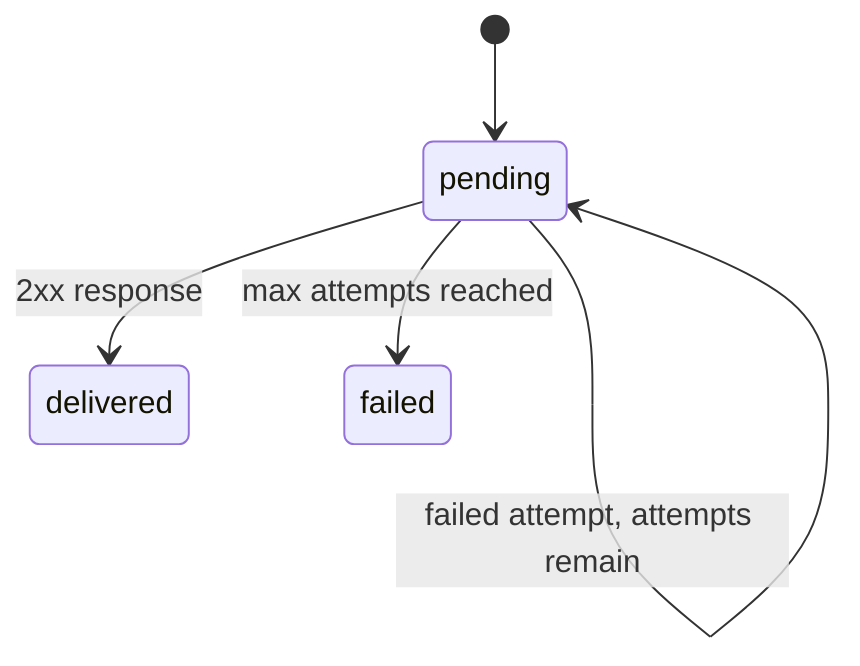

# mem9 Webhooks API Design

## Background

mem9 webhooks let external systems react to memory lifecycle and Space Chain routing events without polling. The implementation keeps mem9 as the source of truth: endpoint configuration, signing secrets, event records, delivery outbox, delivery attempts, retry state, and logs all live in the mem9 control-plane database.

Console products only proxy and aggregate this API. They must not persist webhook endpoint state or delivery state.

## Requirements

- Support Space-scoped webhook endpoints authenticated with the existing `X-API-Key`.
- Support Space Chain-scoped webhook endpoints authenticated with the `chain_` management key.
- Emit v1 events only:
  - `memory.added`
  - `memory.deleted`
  - `space_chain.fact_routed`
- Deliver signed JSON payloads to HTTPS URLs. Local HTTP is allowed only outside production.
- Retry transient delivery failures with backoff and preserve delivery history.
- Return `signing_secret` only on create and rotate-secret responses.

## Event Model

Each event is stored once in `webhook_events` and faned out to enabled matching endpoints through `webhook_deliveries`.

```json
{
  "id": "evt_...",
  "type": "memory.added",
  "api_version": "2026-06-08",
  "created_at": "2026-06-08T00:00:00Z",
  "scope": {
    "type": "tenant",
    "tenant_id": "...",
    "external_space_id": "...",
    "chain_id": "..."
  },
  "data": {}
}
```

### memory.added

Emitted after a memory create path succeeds:

- direct content create
- pinned create
- smart ingest ADD action
- routed Space Chain target ADD action

Smart ingest UPDATE actions do not emit `memory.added`.

Payload:

```json
{
  "memory": {
    "id": "...",
    "content": "...",
    "memory_type": "insight",
    "agent_id": "...",
    "appId": "...",
    "session_id": "...",
    "tags": [],
    "metadata": {},
    "created_at": "...",
    "updated_at": "..."
  }
}
```

### memory.deleted

Emitted after a single or batch delete succeeds.

Payload:

```json
{
  "memory": {
    "id": "...",
    "tenant_id": "...",
    "deleted_by_agent": "...",
    "deleted_at": "..."
  }
}
```

### space_chain.fact_routed

Emitted to the Space Chain scope when extracted facts match a target Space routing policy and the target Space write succeeds. Quota-denied or failed target writes do not emit this event.

Payload:

```json
{
  "route_id": "...",
  "chain_id": "...",
  "source_tenant_id": "...",
  "target_tenant_id": "...",
  "target_external_space_id": "...",
  "routing_policy_node_id": "...",
  "source_facts": [],
  "target_memory": {},
  "agent_id": "...",
  "appId": "...",
  "session_id": "..."
}
```

## APIs

Space scope, using `X-API-Key`:

- `GET /v1alpha2/mem9s/webhooks`
- `POST /v1alpha2/mem9s/webhooks`
- `GET /v1alpha2/mem9s/webhooks/{webhookID}`
- `PATCH /v1alpha2/mem9s/webhooks/{webhookID}`
- `DELETE /v1alpha2/mem9s/webhooks/{webhookID}`
- `POST /v1alpha2/mem9s/webhooks/{webhookID}/test`
- `POST /v1alpha2/mem9s/webhooks/{webhookID}/rotate-secret`
- `GET /v1alpha2/mem9s/webhook-deliveries`

Space Chain scope, using `chain_` management key:

- `GET /v1alpha2/space-chains/{chainID}/webhooks`
- `POST /v1alpha2/space-chains/{chainID}/webhooks`
- `GET /v1alpha2/space-chains/{chainID}/webhooks/{webhookID}`
- `PATCH /v1alpha2/space-chains/{chainID}/webhooks/{webhookID}`
- `DELETE /v1alpha2/space-chains/{chainID}/webhooks/{webhookID}`
- `POST /v1alpha2/space-chains/{chainID}/webhooks/{webhookID}/test`
- `POST /v1alpha2/space-chains/{chainID}/webhooks/{webhookID}/rotate-secret`
- `GET /v1alpha2/space-chains/{chainID}/webhook-deliveries`

Create request:

```json
{
  "name": "Production sync",
  "url": "https://example.com/mem9/webhook",
  "enabled": true,
  "events": ["memory.added", "memory.deleted"]
}
```

Create and rotate-secret responses include one-time `signing_secret`; list/get/update responses never include it.

## Signing

Each delivery includes:

- `X-Mem9-Event-Id`
- `X-Mem9-Event-Type`
- `X-Mem9-Timestamp`
- `X-Mem9-Signature`

Signature format:

```text
v1=<hex_hmac_sha256>
```

The HMAC input is:

```text
<timestamp>.<event_id>.<raw_body>
```

Consumers should verify the timestamp tolerance, recompute with the current signing secret, and compare in constant time.

## URL Validation

- Production requires HTTPS.
- Development allows HTTP only for `localhost`, `127.0.0.1`, and `::1`.
- Userinfo URLs are rejected.
- Literal private, link-local, loopback, and unspecified IP destinations are rejected unless the local-development exception applies.

## Data Tables

`webhook_endpoints`

- endpoint metadata
- scope type and ID
- event subscriptions as JSON
- encrypted signing secret
- soft-delete marker

`webhook_events`

- immutable event envelope
- scope and type for filtering

`webhook_deliveries`

- endpoint fanout rows
- status, attempt count, retry schedule
- latest HTTP status or error
- delivered timestamp

## Delivery State Machine



Default backoff:

- attempt 1: 1 minute
- attempt 2: 5 minutes
- attempt 3: 30 minutes
- attempt 4: 2 hours
- attempt 5: 6 hours
- later attempts: 24 hours

## Space And Space Chain Boundaries

Space webhooks are bound to a tenant/Space API key and only observe that Space. Space Chain webhooks are bound to a chain management key and observe chain-scope events. When a chain write creates a memory in a target Space, mem9 emits the target Space `memory.added` event and the chain `memory.added` event. Routing-specific metadata is emitted separately as `space_chain.fact_routed`.

## Console Integration

`mem9-console-server` proxies webhook CRUD/test/rotate/delivery calls to mem9 using the current Space API key or Chain management key. It also exposes project-level aggregation endpoints by reading the console project Spaces and Space Chains, then calling mem9 for each resource.

`mem9-console-fe` renders a project-level `/console/webhooks` page from those aggregation APIs. It never calls mem9 directly and never stores webhook secrets.

## Testing And Acceptance

mem9:

- CRUD endpoint validation and one-time secret responses.
- secret rotation and HMAC signing.
- URL validation including HTTPS and local development exceptions.
- `memory.added` for direct, pinned, and smart ADD paths.
- no `memory.added` for smart UPDATE-only reconciliation.
- `memory.deleted` for single and batch delete.
- `space_chain.fact_routed` for successful routed target ADDs.
- no routing event when runtime usage denies or target write fails.
- dispatcher success, retry, backoff, and terminal failure.

console-server:

- Space and Space Chain proxy auth and error mapping.
- project aggregation limited to current principal/project resources.
- one-time secret passthrough with no logging.
- no webhook DB migration.

console-fe:

- sidebar entry order: Space, Space Chain, Webhooks, Memories.
- create/edit/test/rotate/disable/delete flows.
- one-time secret reveal modal.
- deliveries drawer/table.
- generated API client is used for all webhook requests.
